# Decentralized Vote App

Decentralized Vote App is a full-stack civic technology platform for secure, region-aware digital elections. The system combines Flutter clients, FastAPI AI services, Foundry smart contracts, and supporting backend infrastructure to deliver verifiable voting flows, strong identity checks, transparent election operations, and cross-region governance tooling.

This repository is structured as an engineering program rather than a single mobile app. It is designed to support election flows for schools, universities, companies, local governments, and broader public-sector voting, while prioritizing identity assurance, auditability, regional controls, and operational scalability.

## Why This Project Exists

Traditional voting systems often fail on one or more of these dimensions: trust, accessibility, auditability, fraud resistance, or operational transparency. This project explores a stronger model built around four principles:

- Verified identity before participation.
- Region-locked election access and policy enforcement.
- On-chain auditability for critical voting events.
- Modern product UX across mobile, desktop, and assisted voting surfaces.

The long-term goal is to provide election infrastructure that can adapt to different governance contexts without sacrificing security posture or public transparency.

## What Makes It Compelling

From an engineering standpoint, this project sits at the intersection of civic systems, distributed infrastructure, biometrics, AI, and application security. It is meant to demonstrate:

- End-to-end system design across Flutter, Python, JavaScript, Solidity, and DevOps tooling.
- Product thinking for sensitive workflows where trust and usability must coexist.
- Real-world architecture tradeoffs around privacy, identity, compliance, payments, and public transparency.
- A deliberate separation of concerns between UX, AI orchestration, backend services, and blockchain verification.

## Core Product Vision

The platform is being shaped around these major capabilities:

- Region-aware voting access with controls that prevent cross-region participation.
- Identity verification flows using live face checks, document checks, and device-level trust signals.
- Election management backed by smart contracts for verifiable vote execution and result handling.
- Candidate discovery, manifesto viewing, discussion forums, and public engagement workflows.
- Transparent election visibility across countries, regions, contests, and participation outcomes.
- Assisted access patterns for users who may need physical voting centers or hardware-supported verification.

## Architecture Overview

### Client Layer

- Flutter application for mobile, desktop, and web-facing experiences.
- User journeys spanning onboarding, authentication, election exploration, voting, forums, and profile management.

### AI and Orchestration Layer

- FastAPI services for identity verification workflows, fraud scoring, orchestration, and future AI-assisted moderation or evaluation features.
- Background processing support for verification tasks, document analysis, and event-driven workflows.

### Backend Services Layer

- Node.js or Express can support lightweight operational services, integration adapters, webhooks, and utility APIs where Python is not the best fit.

### Blockchain Layer

- Foundry-based smart contract development for election logic, vote submission rules, token-based fee handling, and auditable state transitions.

### Data and Infrastructure Layer

- PostgreSQL for core application data.
- Redis for caching and queue support.
- Docker, containerized services, and deployment-ready infrastructure assets for local and cloud environments.

## Repository Structure

- `Flutter-decentralized-vote/`: cross-platform client application.
- `Fastapi-decentralized-vote/`: AI services, API orchestration, and backend workflows.
- `Backend-decentralized-vote/`: Node.js backend services and supporting modules.
- `Foundry-smartcontract-vote/`: Solidity contracts, scripts, and tests.
- `pictures/`: product screenshots used for presentation and documentation.

## Engineering Priorities

This codebase is strongest when evaluated as an infrastructure-oriented product. The important technical themes are:

- Security-first workflow design for identity-sensitive operations.
- Modular service boundaries across client, AI, backend, and blockchain components.
- Clear room for future hardening around privacy, fraud prevention, and compliance.
- Product breadth that goes beyond voting to include discovery, participation, community interaction, and election transparency.

## Screens and Product Flow

The gallery below follows the current UI journey from splash and onboarding through authentication and into the main product surfaces. `signupC` and `signup` are intentionally shown side by side in the authentication sequence.

| Col 1 | Col 2 | Col 3 | Col 4 | Col 5 |
| --- | --- | --- | --- | --- |
| 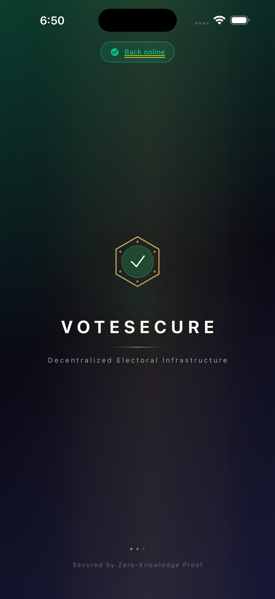 | 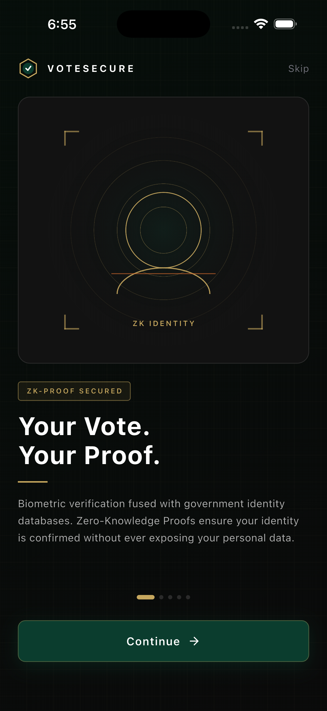 | 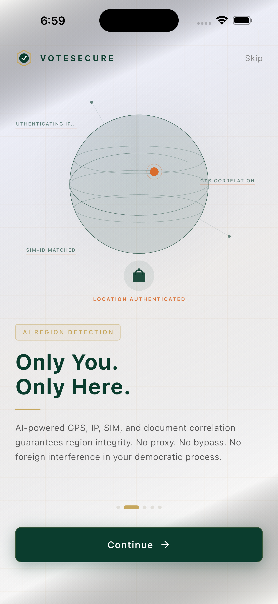 | 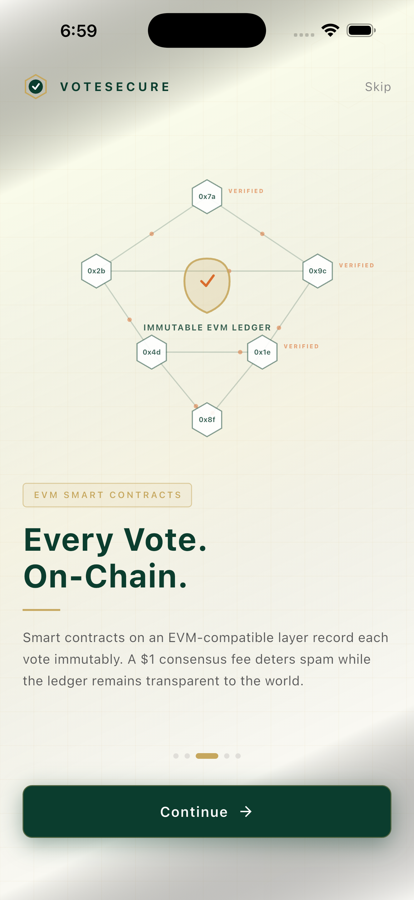 | 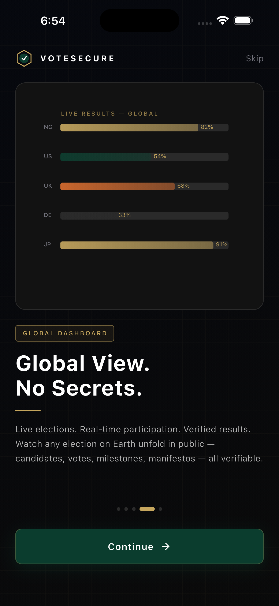 |
| 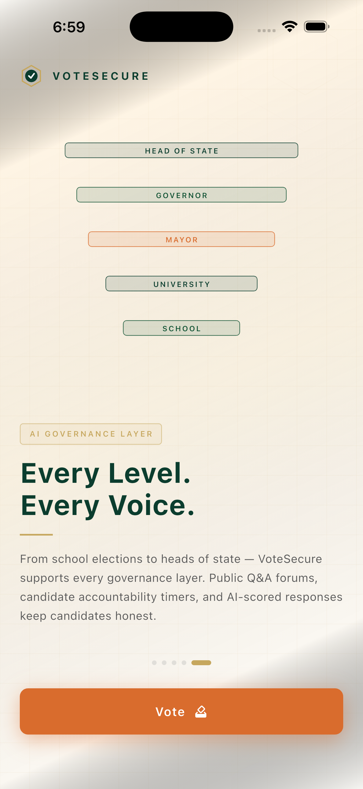 | 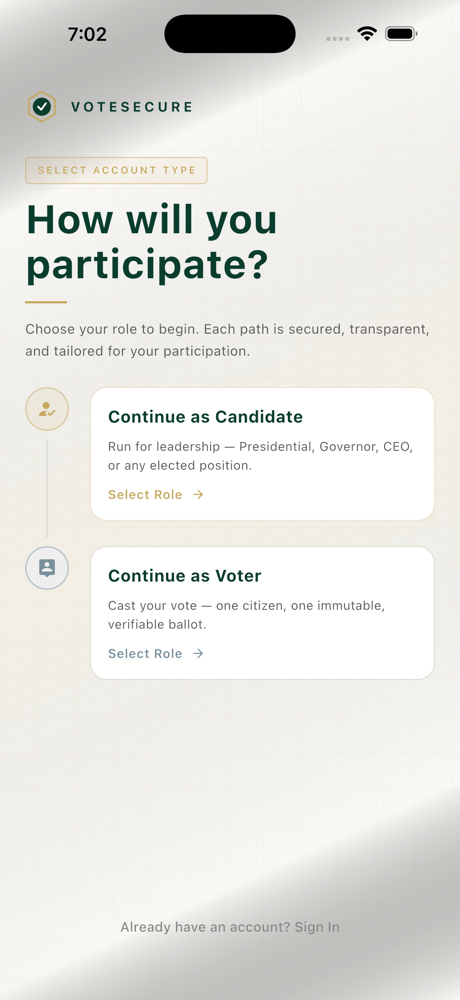 | 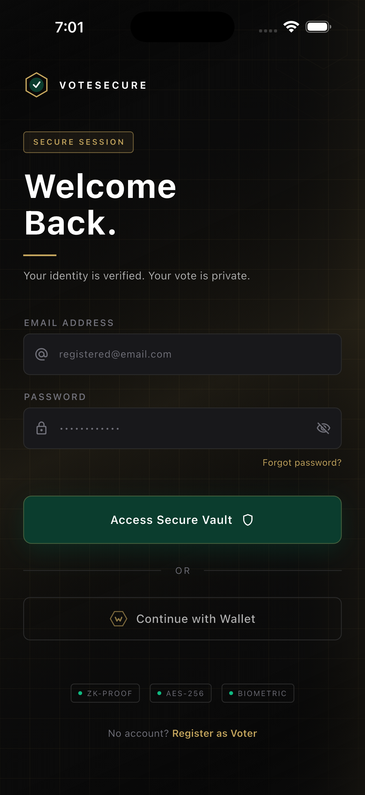 | 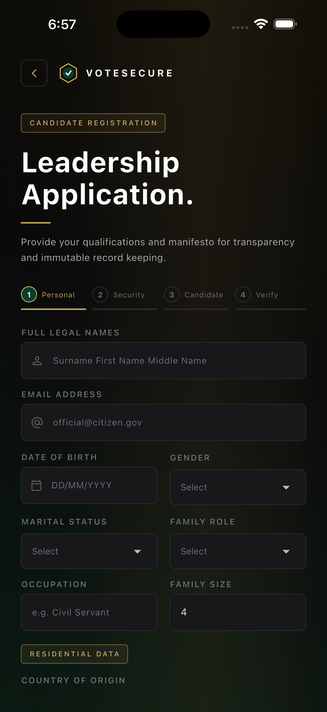 | 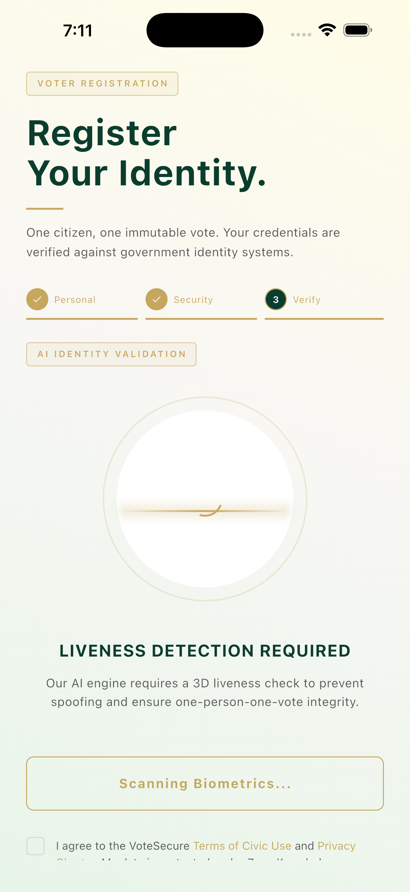 |
| 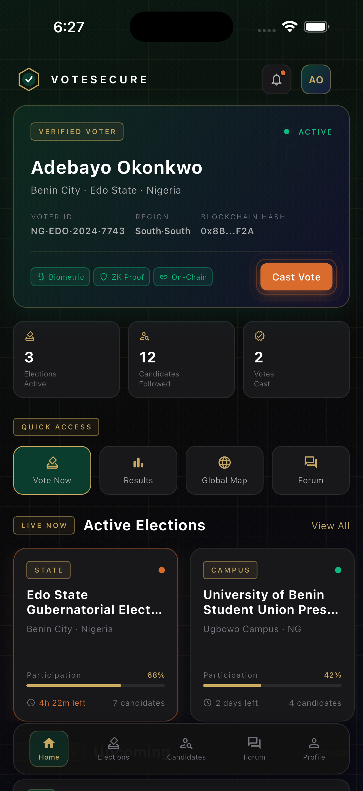 | 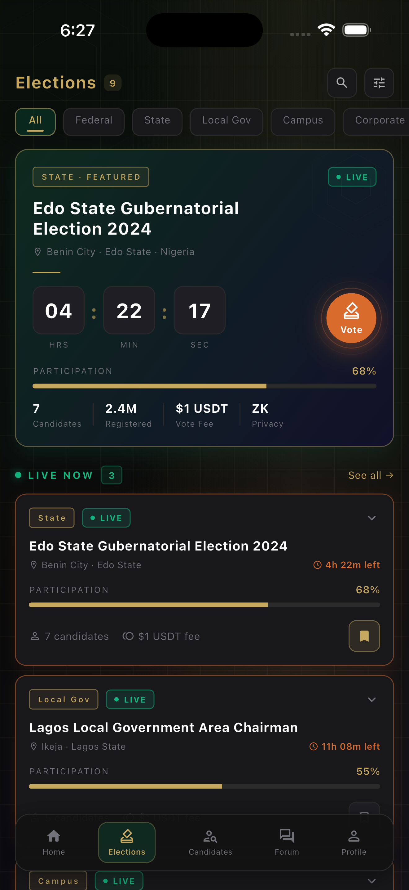 | 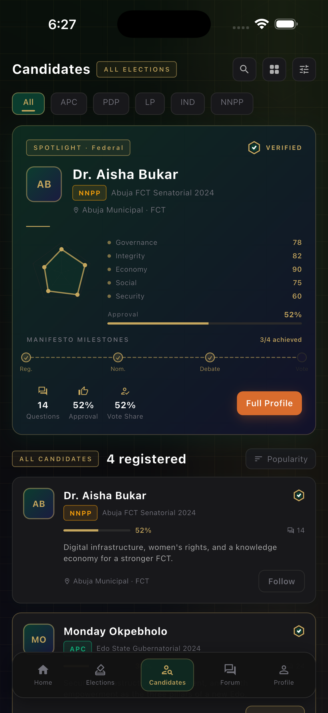 | 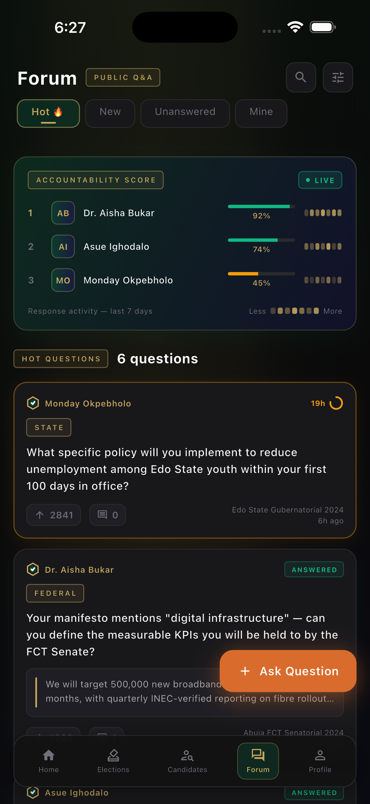 | 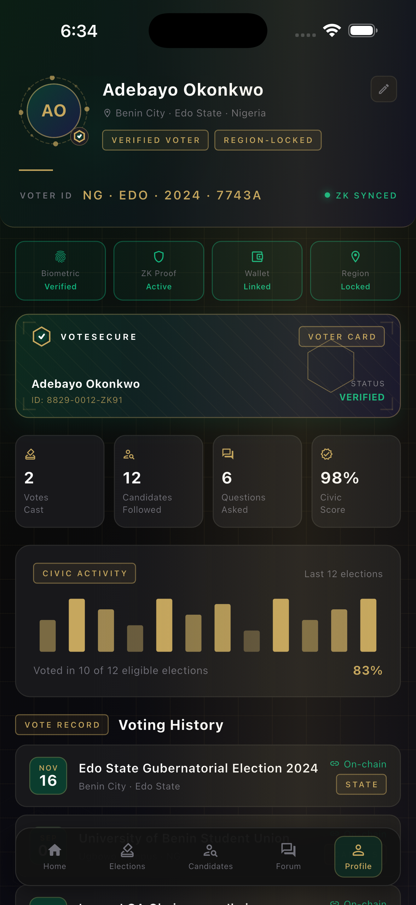 |
|  |  |  |  |  |
|  |  |  |  |  |

## Current Positioning

For employers, recruiters, and senior engineers reviewing this project, the main signal is not just feature count. The signal is that this repository tackles a difficult systems problem with a multi-stack architecture, explicit trust boundaries, and a credible path from product UX to verifiable infrastructure.

It shows ambition in the right places: platform scope, security-sensitive workflow design, distributed systems thinking, and a willingness to handle hard constraints instead of avoiding them.

## Next Milestones

- Tighten the README in each subproject so every layer has its own setup and architecture notes.
- Add sequence diagrams for identity verification, vote casting, and result publication.
- Add threat model documentation, contract architecture notes, and deployment topology diagrams.
- Add demo data or scripted walkthroughs so reviewers can evaluate the product flow faster.
